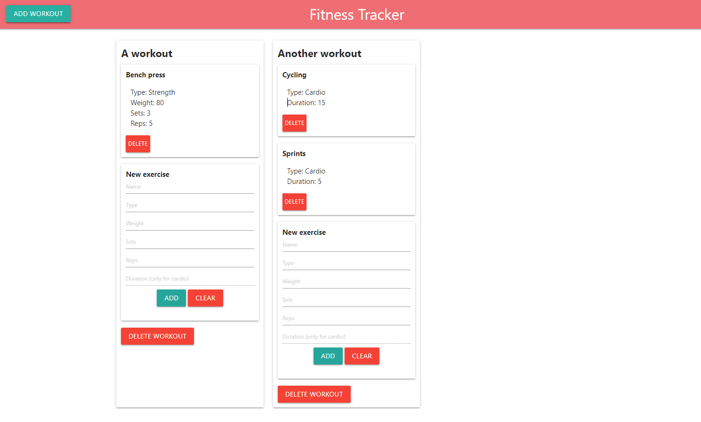

# fitness-tracker

## Description
A workout planning/tracking application. 'Workouts' contain lists of exercises and exercises show the type, weight, sets, reps, and duration of the exercise. The duration property can only be set for exercises of type 'cardio'.

This application is meant to serve as practice for utilizing MongoDB and the Mongoose Node package. The 'workouts' and 'exercises' are stored as collections, with each 'workout' containing a list of 'exercises'. 

## Usage
[A deployed version of the application can be found here.](https://fitness-tracker-mtrupiano.herokuapp.com/home)

Use the buttons to add and remove workouts and individual exercises.

